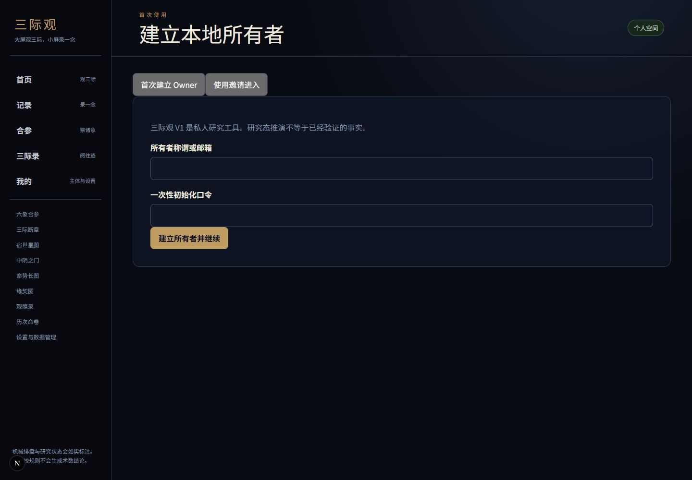
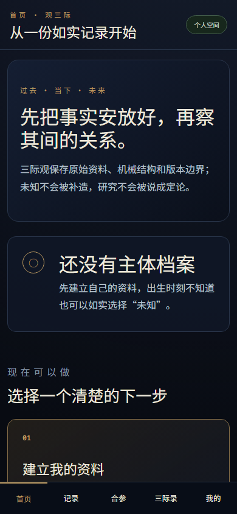

# 三际观

> V1.1 产品质量工作不改变确定性引擎、研究 Ruleset、Replay 语义或受保护 Hash。参见
> [V1.1 交付说明](docs/product/v1-1-delivery.md)、[用户指南](docs/user-guide.md)与
> [质量验证](docs/testing/v1-1-quality.md)。

> 观因于往际，察缘于当下，见势于未来。

三际观是一套面向少数授权使用者的确定性私人研究系统。V1 把个人记录、传统术数结构、
三际原创证据合参、宿世/中阴/缘契专题、命势长图、三际断章和三际录连接成可追溯、可
Replay、可重新分析的完整链路。

当前版本为 `1.0.0-rc.1` 工程候选。项目所有者已授权开源；没有 Tag 或 GitHub Release。
所有传统 Profile 与原创规则仍为
`research_active / UNCONFIRMED / production_activatable=false`。

> **术数引擎定象，规则引擎成断，DeepSeek只成文。**

结构化结果只由 [`packages/sanji-engine`](packages/sanji-engine/) 决定。DeepSeek 可以造景，
不能造术；没有 AI 密钥时完整确定性报告仍可使用。

## 产品截图

| 首次进入（桌面） | 首页（移动） |
|---|---|
|  |  |

截图只使用虚构或空状态资料。

## V1 功能

- 邀请制 Owner/Member 安全会话、完整原始出生记录与主体隔离。
- 易经实物三钱、八字、受限三合紫微和京房纳甲六爻的版本化研究 Profile。
- 六象、宿世、中阴、缘契、命势长图和三际断章的三际原创研究链路。
- PostgreSQL 三际录、FORCE RLS、导出/删除、Replay、Reanalysis 和版本比较。
- 无 DeepSeek 密钥时的完整确定性回退；可选模型只润色白名单文字。

## 架构

```text
Web/PWA → FastAPI → Application Services → sanji-engine（三际枢）
                                                ↓
                              PostgreSQL / RLS / Replay / Audit
                                                ↓
                                   可选 DeepSeek 成文层
```

完整入口见 [系统地图](docs/handoff/system-map.md) 和
[三际枢契约](docs/architecture/sanji-engine-contract.md)。

## 快速开始

需要 Git、Docker 和 Docker Compose：

```bash
git clone https://github.com/Caishenboon/sanjiguan.git
cd sanjiguan
python scripts/init_env.py
docker compose up --build
```

打开 `http://127.0.0.1:3000/start`，使用忽略文件 `.env` 中的
`OWNER_BOOTSTRAP_TOKEN` 完成首次所有者建立。口令只在本机读取，不要粘贴到聊天、
日志或提交记录。

停止与重启：

```bash
docker compose down
docker compose up -d
docker compose logs -f web api
```

`docker compose down` 不删除数据库卷。彻底清理必须显式执行
`docker compose down --volumes`；该操作不可恢复。

全新电脑请使用 [Windows 手册](docs/setup/new-machine-windows.md) 或
[Linux 手册](docs/setup/new-machine-linux.md)。新 Codex 从
[AI 交接入口](docs/handoff/README.md) 开始，不依赖旧聊天或本机路径。

## 虚构 Demo

在全新、可丢弃的本地数据库中：

```bash
python scripts/demo.py create
```

Demo 中的主体、地点、梦境、关系和事件全部虚构，不代表现实验证，也不依赖
DeepSeek 或外部完整数据集。

## 算法与 AI 边界

- 普通用户入口固定为：首页、记录、合参、三际录、我的。
- 研究管理员区受服务端会话和角色门禁保护。
- PostgreSQL 是三际录和执行历史的唯一事实来源；浏览器仅保留未提交草稿与显示状态。
- 原版本 Replay 使用不可变版本和 Hash；彻底删除私人快照后明确返回不可回放。
- AI 不参与排盘、证据、评分、排序、吉凶、应期或 Hash。
- API、Web 与 LLM 层不得复制核心算法。
- 传统机械、流派解释、三际原创和 AI 成文必须分层标注。
- 未确认 Profile 不代表传统共识；不得伪造经典、师承或来源。

## Ruleset、Profile 与确定性

Ruleset 和 Profile 都有版本、来源、审校/激活状态与内容 Hash。旧资产不得就地改写；
新版本通过 Reanalysis 显式采用，历史档案仍按原版本 Replay。CI 同时固定 Windows/Linux
结果、旧聚合 Hash、PostgreSQL、视觉、Lighthouse、Secret Scan 与 Gitleaks。

## 数据安全

数据库是档案唯一事实来源；私人表 FORCE RLS，敏感字段加密，API 不信任前端用户 ID。
私人正文不进入日志、Trace、公开页面或模型训练材料。用户可以导出、撤销和删除；彻底
删除导致无法 Replay 时系统明确返回不可用，不伪造恢复。

## 文档入口

- [AI/新工程接手](docs/handoff/README.md)
- [机器可读项目清单](docs/handoff/project-manifest.json)
- [系统架构](docs/architecture/sanji-engine-contract.md)
- [V1 功能与发布清单](docs/releases/v1-checklist.md)
- [本地和服务器部署](docs/deployment/server.md)
- [备份与恢复](docs/operations/backup-restore.md)
- [换电脑迁移](docs/operations/move-computer.md)
- [导出与删除](docs/privacy/data-export-delete.md)
- [DeepSeek 配置](docs/integrations/deepseek-v1.md)
- [安全说明](SECURITY.md)
- [贡献指南](CONTRIBUTING.md)
- [开源准备状态](docs/open-source/readiness.md)
- [首次公开发布摘要](docs/open-source/public-release-summary.md)
- [开源发布封卷](docs/open-source/public-release-closure-v1.md)
- [公开发布待确认决定](docs/open-source/publication-decisions.md)
- [许可证审计](docs/open-source/license-audit-v1-rc.md)
- [知识库公开边界](docs/open-source/knowledge-boundary-v1-rc.md)
- [API 契约](docs/api/openapi.yaml)

## 开源与许可证状态

项目原创软件采用 `AGPL-3.0-or-later`；项目原创规则数据、方法文档和非软件知识结构采用
`CC BY-SA 4.0`。第三方资产保留各自许可，品牌使用另见 `TRADEMARKS.md`。外部数据、
真实用户资料、restricted/sealed 内容和权利不清资产不属于上述授权。当前没有 Tag 或
GitHub Release，所有规则仍为研究态；详见[开源准备状态](docs/open-source/readiness.md)。

## 开发验证

```bash
python -m unittest discover -s tests -p "test_*.py"
python scripts/validate_v1_release.py
cd apps/web && pnpm install --frozen-lockfile && pnpm build
```

完整 CI 还会运行 PostgreSQL 16、RLS、HTTP→PostgreSQL E2E、Windows/Linux
确定性、视觉回归、Lighthouse、Gitleaks、许可证和 Docker 干净启动门禁。

## 当前限制

研究结果不是现实有效性证明或保证预测。外部数据 Connector 默认禁用；生产 KMS、数据地区、备份保留、
删除 SLA、restricted/sealed 内容和生产规则激活仍待负责人或合格审校人确认。

贡献前阅读 [AGENTS.md](AGENTS.md)、[CONTRIBUTING.md](CONTRIBUTING.md) 与
[SECURITY.md](SECURITY.md)。
