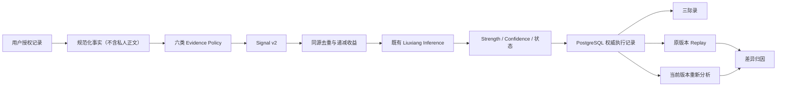

# 六象真实证据与三际录持久化 v1

> 三际观原创研究体系（`sanji_original`）；`research_active / UNCONFIRMED`；不可生产激活。

## 边界



API 和页面不包含评分常量，只调用 `sanji-engine` 的公开入口。DeepSeek、
Oracle、外部研究数据、向量相似度和私人正文均不进入执行、Trace 或 Hash。
浏览器存储只保留未提交草稿、筛选与当前主体选择；三际录和执行历史以
PostgreSQL 为唯一事实来源。

## 六类通道

| 通道 | 输入 | 对 Strength 的作用 |
|---|---|---|
| `lx_ming` 命象 | 出生字段覆盖、机械执行引用、Profile/边界 | 仅 Coverage/Structural；始终为 0 |
| `lx_ye` 业象 | 跨日期重复行为、持续或中断 | 满足最小数量与跨度后递减贡献 |
| `lx_yuan` 愿象 | 表达、一次行动、持续、完成、撤回 | 一句表达贡献受低上限约束 |
| `lx_meng` 梦象 | 用户确认标签、日期、更正/撤回 | 仅确认标签；无吉凶、无预知判断 |
| `lx_yuan_relation` 缘象 | 匿名或有同意的关系事件 | 保留单方/双方差异；无命定标签 |
| `lx_shi` 世象 | 可核验人生事件及原始日期精度 | 不补造具体日期 |

Coverage 只影响执行可用性、缺失项和 Confidence，不得增加 Strength。
Structural 事实不自动转化为人生解释。干支、十神、星曜、卦象的解释性
映射继续 `disabled + UNCONFIRMED`。

## Evidence Policy

资产 `liuxiang-evidence-policies/1.0.0` 为每个通道冻结最小独立记录数、
最小跨度、单事件与独立组上限、同日上限、整数基点递减表、可靠度上限、
撤回/缺失/冲突行为及内容 Hash。一个原始记录即使有多个标签也只形成一个
独立证据组；同一事件的多个描述必须共用 `shared_source_group`。

撤回记录不参与新执行。历史执行保存当时的加密输入、结果、规则束、Policy、
Profile、数据版本和 Replay Manifest，因此仍可按原版本重放。

## 三际录、重新分析与比较

`0016_liuxiang_evidence_archive_v1.sql` 新增私有执行、证据引用、三际录、
Replay 审计与比较表。全部私人表启用并强制 RLS，严格绑定
`owner_id = app_current_user_id()`。公共研究数据不进入私人表，删除主体会级联
删除私人派生记录而不影响共享公共研究资产。

重新分析总是创建新的执行和三际录条目。比较结果分别说明：记录增加、记录撤回
或移除、Policy、Ruleset、Engine、Profile 和日期精度变化，不能只返回“结果不同”。

## English summary

This research-only boundary converts authorized, normalized user facts into
Signal v2, applies versioned integer-basis-point evidence policies, and stores
immutable executions in a PostgreSQL-backed Sanji archive. Coverage never adds
strength. Private narrative is excluded from traces. Replay uses original
versions; reanalysis creates a new child record and comparison attributes the
change. Interpretive astrology/divination mappings remain disabled and
unconfirmed.

## 虚构 Demo 与限制

`user-evidence-conformance-v1.json` 含 72 个完全虚构案例，仅证明确定性、
撤回、同源去重、时间精度、状态机、Replay 与跨平台 Hash；不证明现实有效性。
运行：

```text
python -m unittest tests.test_sanji_engine_liuxiang_evidence_v1 -v
```

## Sensitive snapshot erasure

The immutable execution snapshot contains normalized facts and record
references, never journal, dream, or relationship narrative. Withdrawal keeps
the historical encrypted snapshot available for original-version replay while
excluding that record from every new run.

An owner may separately request irreversible erasure of an execution's
canonical input snapshot. The API replaces the encrypted snapshot with an empty
encrypted object, records the purge time and reason, disables replay on both the
execution and its archive entry, and returns `replay_unavailable` for later
replay attempts. It never reconstructs erased input from current mutable
records. Comparisons that require an erased snapshot are also rejected rather
than fabricated.
