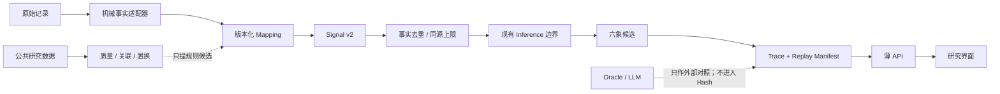

# 确定性六象研究平台 v1

## 边界



核心可在无 Web、FastAPI、PostgreSQL、网络和 DeepSeek 的环境中独立运行。
应用层只能调用 `validate_request`、`execute`、`replay` 与
`inspect_ruleset`，不得复制评分常量。

## Signal v2

Schema 位于
`packages/sanji-engine/src/sanji_engine/schemas/v2/signal-v2.schema.json`。
它显式记录 subject、维度、方向、整数强度、来源记录与事实路径、数据集
Revision、Mapping 规则、Profile、来源与映射可靠度、独立组、同源组、
支持、逆证、缺失、争议、边界敏感、Trace 与内容 Hash。

内容 Hash 排除且只排除 `content_hash` 自身。数组在验证阶段按契约排序；
Signal 集在 Engine input hash 前按维度与稳定 ID 排序。旧 Signal v1 路径
仍保持冻结的顺序兼容行为。

## Mapping

规则资产：

- `liuxiang-mappings/1.0.0`
- `LX.SYNTHETIC.CONFORMANCE.V1`：唯一启用映射，仅验证工程性质；
- 易经、八字、紫微候选映射：`UNCONFIRMED + disabled`。

机械事实适配器不会解释字段。外部数据、Oracle、文本相似度与 LLM 不能生成
Signal。

## Strength

单个 Signal 的有效整数贡献：

```text
round_half_even(
  magnitude_bp × source_reliability_bp × mapping_reliability_bp
  / 100,000,000
)
```

先对相同事实+Mapping 路径完全去重，再对同维度、同方向、同
`shared_source_group` 仅保留最强值。候选 Strength 为：

```text
clamp(sum(support) - sum(counterevidence), 0, 10,000)
```

该值不包含完整度、Profile 一致性或边界稳定性。

## Confidence

Confidence 是整数加权组件：

| 组件 | 权重 |
|---|---:|
| 来源×映射可靠度 | 25 |
| 独立证据数量 | 20 |
| 信息完整度 | 25 |
| Profile 一致性 | 10 |
| 边界稳定性 | 10 |
| 数据质量/缺失 | 10 |

正反贡献重叠另施冲突扣减。因此可出现高 Strength、低 Confidence。权重与
阈值属于 `liuxiang-inference/1.0.0`，仍为原创、未确认、不可生产激活。

## 状态机

- `insufficient`：完整度低于 4000 bp 或无独立证据；
- `contested`：硬冲突，或前二差距不超过 800 bp 且次位至少 2500 bp；
- `decisive`：领先 Strength、Confidence、独立数与差距同时达阈值；
- `provisional`：有支持但尚不满足成断条件。

稳定排序依次为 Strength 降序、Confidence 降序、维度稳定键、候选 ID。

## Trace 与 Replay

Trace 记录验证、事实指纹、完全去重、同源上限、每项整数计算、状态阈值和
排序。Replay Manifest 固定 Engine、Ruleset、数据版本、input、trace 与
领域 Hash。旧 30 例与新 100 例分别维护，互不覆盖。

## 数据分层

- `synthetic_conformance`：只证明工程性质；
- `mechanical_reference`：只核验排盘/转换；
- `external_research_unverified`：初始公共数据；
- `retrospective_observational`：来源、质量与许可证审查后方可晋级；
- `prospective_blind`：只有 Schema 与禁用入口，本轮无数据。
