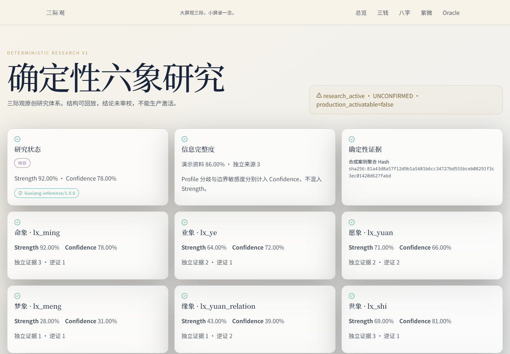
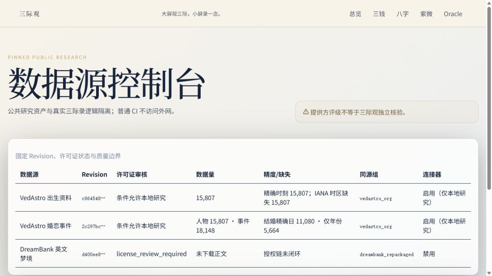
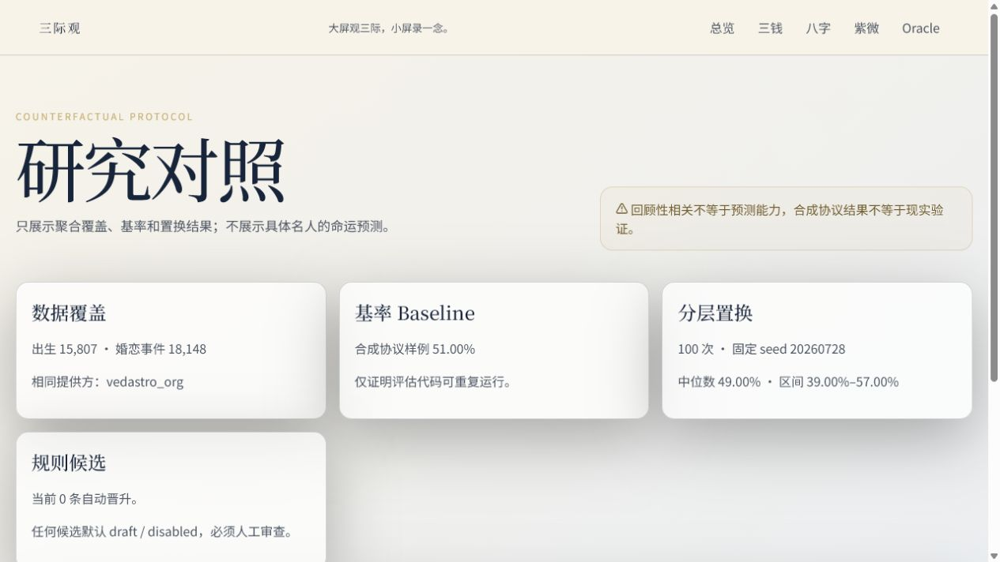

# 确定性六象研究平台 v1 交付说明

本 Sprint 在单一 Monorepo 与既有 `sanji-engine` 边界中增加 Signal v2、
六象原创领域契约、整数合参、同源去重、Trace/Replay、公共数据管线、
PostgreSQL 研究表、薄 API 与三个研究页面。

生产状态未改变。易经、八字、紫微只开放已经存在的机械事实适配边界，三者
到六象的语义映射均为 `UNCONFIRMED + disabled`。宿世、中阴、缘契最终断定、
人生 K 线、最终吉凶/应期、DeepSeek 成文与生产激活均未实现。

## 验收入口

- `python -m unittest tests.test_sanji_engine_liuxiang_v1 -v`
- `python -m unittest tests.test_research_data_pipeline -v`
- `python scripts/research_data.py validate`
- `python scripts/validate_liuxiang_research_v1.py`
- `python scripts/capture_signals_inference_baseline.py`
- `python scripts/migrate.py`（PostgreSQL 16，执行两次）
- Web：`/admin/research/liuxiang`、`/admin/research/data-sources`、
  `/admin/research/controls`

## 合成研究界面

## 已知技术债

1. “感应象”与当前“命象”六项契约的产品定义冲突待产品负责人确认；
2. 机械事实到六象的传统/原创映射尚无审校依据，因此全部禁用；
3. VedAstro 无 IANA/DST 字段，完整排盘资格仍须历史时区核验；
4. VedAstro 固定仓库缺少独立 LICENSE 文件，原始再分发继续禁用；
5. DreamBank 原始授权链未闭环，连接器与正文摄入继续禁用；
6. 外部观察尚未晋级 `retrospective_observational`；
7. `prospective_blind` 只有 Schema 与禁用入口，未伪造数据。
